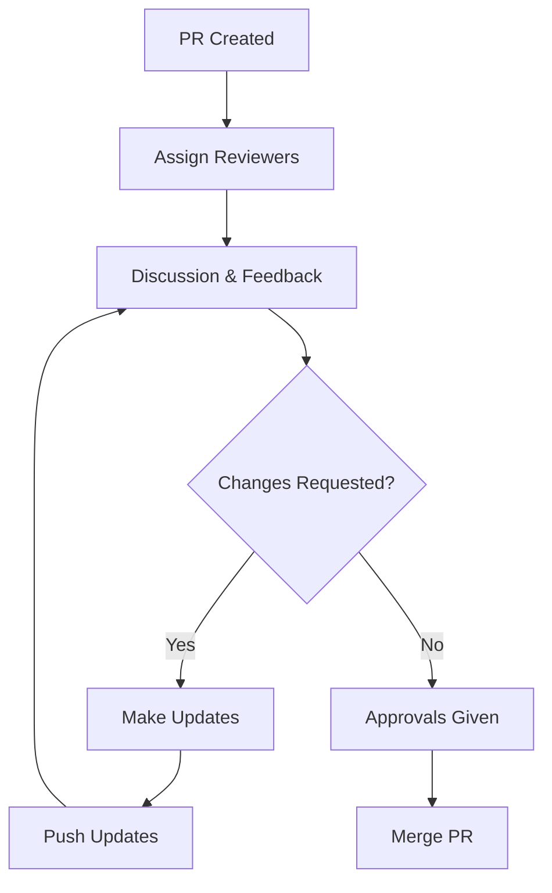

# Git Workflow Guide

!!! info "Consolidated Documentation"
    This guide consolidates all Git workflow information for DRUIDS, including content previously in separate files for Obsidian Git configuration, workflows, and offline usage. For specific Obsidian plugin configuration details, see the [Obsidian Configuration](#automated-sync-configuration) section below.

## Overview

This guide consolidates all Git workflow information for DRUIDS, covering automated synchronization, branch management for security tiers, pull request processes, conflict resolution, and commit signing. It's designed for both individual and collaborative vault management with a focus on security and democratic principles.

## Quick Start

### Essential Commands

```bash
# Modern tool usage (preferred)
rg "pattern" --type md      # Search in markdown files
fd "*.md" docs/             # Find all markdown files
bat config.yaml             # View file with syntax highlighting

# Basic Git operations in Obsidian
"Obsidian Git: Pull"        # Fetch latest changes
"Obsidian Git: Commit all"  # Commit all changes
"Obsidian Git: Push"        # Push to remote
```

### Daily Workflow

1. **Start of day**: Pull latest changes
2. **During work**: Commit regularly with meaningful messages
3. **Before sharing**: Push changes to remote
4. **Switching tiers**: Always commit first, then switch branches

## Automated Sync Configuration

### Setting Up Auto-Sync

1. **Access Settings**
   - Open Obsidian → Settings → Community plugins → Obsidian Git

2. **Configure Intervals**

   ```yaml
   Vault backup interval: 15  # minutes
   Auto backup: ✓ enabled
   Auto pull: ✓ enabled  
   Auto push: ✓ enabled
   ```

3. **Set Commit Messages**

   ```yaml
   # Good static messages
   "chore: automatic vault sync"
   "docs: periodic backup"
   "feat: regular snapshot"
   ```

4. **Enable Pull on Startup**
   - ✓ Pull updates on startup (highly recommended)

### Prerequisites for Auto-Sync

- **Git Authentication**: SSH keys or credential manager configured
- **Remote Repository**: Properly configured origin
- **No Conflicts**: Resolved merge conflicts
- **Internet Connection**: Stable connectivity

### Monitoring Auto-Sync

- Check status bar for sync indicators
- Review commit history periodically
- Watch for error notifications
- Verify remote updates on GitHub

## Branch Management for Security Tiers

### Core Principles

1. **Branch per Tier**: Each security level has its own branch
2. **Default to Lowest**: Stay on `main` (L0) unless needed
3. **Conscious Switching**: Deliberate action for higher tiers
4. **No Merge Down**: Never merge sensitive info to lower tiers
5. **Feature Branches**: Create temporary branches for complex work

### Security Tier Branches

#### main (L0 - Public)

```yaml
Purpose: Public, unclassified information
Auto-sync: Safe to enable all features
Collaboration: Open to all members
Visual: 🟢 Green borders
```

#### L1-internal (Member Only)

```yaml
Purpose: Internal team information
Auto-sync: Consider manual push
Collaboration: Trusted members only
Visual: 🟤 Brown borders

Switching Protocol:
1. Commit all changes on current branch
2. "Obsidian Git: Checkout branch" → L1-internal
3. "Obsidian Git: Pull" immediately
4. Work on L1 content
5. Commit before switching back
```

#### L2-secure (Highly Sensitive)

```yaml
Purpose: Confidential, restricted information
Auto-sync: DISABLE auto-push, manual only
Collaboration: Minimal, need-to-know
Visual: 🔴 Red borders

Critical Rules:
- Double-check branch before every commit
- Review staged changes carefully
- Manual push only
- Consider local-only or encrypted remote
```

### Branch Switching Workflow


### Security Considerations

- **Global Auto-Push**: Be aware it affects ALL branches
- **Mitigation Options**:
  - Disable global auto-push, use manual push for L1/L2
  - Temporarily disable before switching to sensitive branches
- **User Training**: Essential for all vault users
- **Accidental Commits**: Have remediation procedures ready

## Pull Request Workflow

### Overview of Roles

- **Obsidian-Git**: Local operations (branches, commits, push/pull)
- **GitHub**: Remote collaboration (PR creation, review, merge)

### Creating a Pull Request

#### 1. Local Preparation (Obsidian)

```bash
# Update base branch
"Obsidian Git: Checkout branch" → main
"Obsidian Git: Pull"

# Create feature branch
"Obsidian Git: Create new branch"
# Name: feature/description or initials/description

# Make changes and commit
"Obsidian Git: Stage all"
"Obsidian Git: Commit staged"
# Write clear commit messages

# Push to remote
"Obsidian Git: Push"
```

#### 2. PR Creation (GitHub)

1. Navigate to repository on GitHub
2. Click "New pull request"
3. Select branches:
   - **Base**: Target branch (main, L1-internal, etc.)
   - **Compare**: Your feature branch
4. Write comprehensive description:
   - Purpose of changes
   - Key modifications
   - How it aligns with goals
   - Related issues
   - Context for reviewers

#### 3. Review Process



**Review Activities**:

- Examine "Files changed" tab
- Leave line-specific comments
- Request modifications if needed
- Approve when satisfied

**Approval Methods**:

- GitHub's formal "Approve" feature (preferred)
- Comment conventions: `+1`, `LGTM`

#### 4. Merging

**Merge Strategies**:

- **Squash and merge**: Combines commits (recommended for features)
- **Create merge commit**: Preserves all commits
- **Rebase and merge**: Linear history (use cautiously - see [[why-rebase-warps-reality|Why Rebase Warps Reality]])

**Post-Merge**:

- Delete feature branch
- All collaborators pull updates

### Secure PR Workflow (Meta Bind)

For enhanced security, use the Obsidian → GitHub PR workflow:


**Security Benefits**:

- No credentials in Obsidian
- Validation before submission
- Audit trail maintained
- Manual review checkpoint

## Handling Merge Conflicts

### Understanding Conflicts

Conflicts occur when:

- Same lines modified in different ways
- Pulling changes that conflict with local edits
- Merging branches with overlapping changes

### Identifying Conflicts

**Conflict Markers**:

```diff
<<<<<<< HEAD
Your local version
=======
Incoming version
>>>>>>> branch-name
```

**Detection Methods**:

- Obsidian-Git error notifications
- Source Control view in sidebar
- `git status` in terminal

### Resolution Process

#### 1. File-by-File Resolution

```bash
# Open conflicted file
# Locate conflict markers
# Choose resolution strategy:
- Keep yours: Delete incoming + markers
- Keep theirs: Delete yours + markers  
- Combine: Manually merge both versions
- Rewrite: Create new solution

# Delete ALL conflict markers
# Save file
```

#### 2. Stage and Commit

```bash
"Obsidian Git: Stage current file"
"Obsidian Git: Commit staged"
# Default merge message often sufficient
```

#### 3. Push Resolution

```bash
"Obsidian Git: Push"
```

### Prevention Strategies

- **Pull frequently** before starting work
- **Communicate** about shared files
- **Use feature branches** to isolate changes
- **Small commits** are easier to resolve

### Aborting a Merge

If overwhelmed, abort and restart:

```bash
git merge --abort  # Terminal command
# Returns to pre-merge state
```

## Commit Signing with GPG

### Why Sign Commits?

- **Authenticity**: Proves you made the commit
- **Integrity**: Ensures commit hasn't been altered
- **Trust**: Critical for sensitive branches (L1/L2)

### Setup Process

#### 1. System Configuration

```bash
# Install GPG
gpg --version

# Generate or import key
gpg --full-generate-key

# List keys
gpg --list-secret-keys --keyid-format LONG

# Configure Git
git config --global user.signingkey YOUR_KEY_ID
git config --global commit.gpgsign true
git config --global tag.gpgsign true
```

#### 2. GPG Agent Setup

Essential for automated signing:

```bash
# Add to shell profile
export GPG_TTY=$(tty)

# Configure agent to cache passphrase
# Allows background signing
```

### Hardware Security Keys

For maximum security on L2 branches:

- Store GPG key on YubiKey/Nitrokey
- Key never leaves hardware
- Physical touch required to sign

### Verification

```bash
# Check local signatures
git log --show-signature

# GitHub shows "Verified" badge
# Upload public key to GitHub
```

### Important Limitations

- **Mobile**: Signing not supported on iOS/Android
- **Automation**: Requires GPG agent for auto-commits
- **Complexity**: Advanced feature, team training needed

## Best Practices

### Security-First Approach

1. **Always verify branch** before committing
2. **Review changes** before pushing sensitive branches
3. **Use visual indicators** as primary guide
4. **Manual push** for L2 content
5. **Sign commits** on sensitive branches

### Collaboration Guidelines

1. **Clear commit messages** describing changes
2. **Small, focused commits** over large changes
3. **Comprehensive PR descriptions**
4. **Constructive review feedback**
5. **Prompt response** to review requests

### Automation Balance

1. **Enable auto-sync** for public branches
2. **Manual control** for sensitive content
3. **Monitor status** regularly
4. **Test authentication** periodically
5. **Document exceptions** to standard workflow

## Troubleshooting

### Auto-Sync Issues

```bash
# Check authentication
git push origin main  # Test manually

# Verify configuration
git config --list | grep -E "(user|commit|remote)"

# Check for conflicts
git status
git diff
```

### Branch Problems

```bash
# List all branches
git branch -a

# Force checkout if stuck
git checkout -f branch-name

# Reset to remote state
git reset --hard origin/branch-name
```

### Conflict Resolution Help

```bash
# Show conflict details
git diff --name-only --diff-filter=U

# Use external merge tool
git mergetool

# Get help from team
# Don't guess on important conflicts
```

## Quick Reference Card

```
┌─────────────────────────────────────┐
│        GIT WORKFLOW QUICK REF       │
├─────────────────────────────────────┤
│ Daily Commands:                     │
│   Pull → Work → Commit → Push       │
├─────────────────────────────────────┤
│ Branch Before Switch:               │
│   Commit → Checkout → Pull          │
├─────────────────────────────────────┤
│ Security Branches:                  │
│   L0/main = Auto-sync OK           │
│   L1 = Consider manual push        │
│   L2 = Manual push ONLY            │
├─────────────────────────────────────┤
│ Conflicts:                          │
│   Don't panic → Read markers       │
│   Choose resolution → Delete marks │
│   Stage → Commit → Push            │
└─────────────────────────────────────┘
```

## Related Documentation

- [[druids-security-implementation|Security Implementation]] - Full security model details
- [[democratic-centralism|Democratic Centralism]] - Organizational principles
- [[complete-setup-guide|Obsidian Setup]] - Plugin setup

---

*Remember: Good Git discipline protects both your work and your organization. When in doubt, ask for help!*
