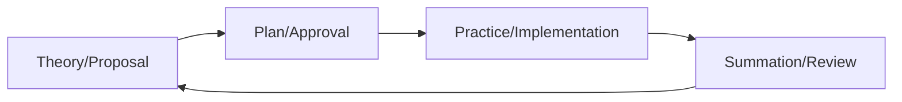

# Project Management Guide for DRUIDS

## Introduction

This guide demonstrates how to manage projects within the DRUIDS framework, from proposal through completion. It covers the full project lifecycle, task assignment, progress tracking, and integration with democratic centralist principles through the TPPS (Theory-Plan-Practice-Summation) cycle.

## Prerequisites

- Obsidian vault with Kanban and Tasks plugins
- Understanding of TPPS cycle
- Access to appropriate repository (L0 or L1)
- Basic Git knowledge for proposal workflow

## Project Lifecycle Overview



### TPPS Integration

1. **Theory**: Project conceived and proposed
2. **Plan**: Detailed planning after approval
3. **Practice**: Active implementation
4. **Summation**: Review outcomes and lessons learned

## Step-by-Step Project Workflow

### 1. Project Proposal (Theory Phase)

#### Time Estimate: 1-2 hours

**a) Create Project Proposal**

Create file: `02-projects/proposals/YYYY-project-name-proposal.md`

```markdown
---
document_id: INT-PRJ-2024-001-L1
title: "Project Proposal: Member Education Platform"
type: proposal
security: L1
status: draft
proposed_by: "Member A"
proposed_date: 2024-01-20
tpps_phase: theory
tags: [project, proposal, education]
---

# Project Proposal: Member Education Platform

## Executive Summary

Brief 2-3 sentence overview of what this project will accomplish and why it matters to the organization.

## Problem Statement

### Current Situation
- New members struggle to find educational resources
- Training materials scattered across different platforms
- No clear learning progression path

### Impact
- Slower member development
- Inconsistent political education
- Higher dropout rate for new members

## Proposed Solution

### Overview
Create a centralized education platform in Obsidian that provides:
- Structured learning paths
- Progress tracking
- Resource library
- Self-assessment tools

### Key Features
1. **Onboarding Path**: 30-day structured program
2. **Resource Library**: Searchable, tagged content
3. **Progress Dashboard**: Visual tracking of completion
4. **Assessment System**: Knowledge checks and practical exercises

## Success Criteria

- [ ] 80% of new members complete onboarding within 45 days
- [ ] Average satisfaction rating of 4/5 or higher
- [ ] 50+ educational resources organized and accessible
- [ ] Automated progress tracking functioning

## Resource Requirements

### Human Resources
- Project Lead: 10 hours/week for 8 weeks
- Tech Support: 5 hours/week for 8 weeks
- Content Team: 3 people × 5 hours/week for 6 weeks

### Technical Resources
- Obsidian Enterprise license (if needed)
- Additional plugins: $0 (all free)
- Hosting: Using existing infrastructure

### Budget
- Total: $500
  - Documentation materials: $200
  - Design assets: $150
  - Contingency: $150

## Timeline

### Phase 1: Planning (Weeks 1-2)
- Finalize requirements
- Set up project structure
- Assign team roles

### Phase 2: Development (Weeks 3-6)
- Create templates
- Develop content
- Build dashboards

### Phase 3: Testing (Week 7)
- User testing with 5 volunteers
- Gather feedback
- Make adjustments

### Phase 4: Launch (Week 8)
- Full rollout
- Training sessions
- Documentation finalized

## Risks and Mitigation

| Risk | Likelihood | Impact | Mitigation |
|------|------------|---------|------------|
| Volunteer availability | High | Medium | Have backup assignees |
| Technical complexity | Medium | High | Start with MVP, iterate |
| Content quality | Low | High | Peer review process |

## Alternatives Considered

1. **External LMS**: Too expensive, doesn't integrate with existing tools
2. **Google Docs System**: Lacks structure and tracking
3. **No Change**: Problems will compound as organization grows

## Recommendation

Approve this project for implementation with the understanding that we'll start with a minimum viable product and iterate based on member feedback.

## Appendices

- A: Detailed Technical Specifications
- B: Sample Learning Path
- C: Budget Breakdown
```

**b) Submit via Git Workflow**

```bash
# Create proposal branch
git checkout -b proposal/education-platform

# Add and commit proposal
git add 02-projects/proposals/2024-education-platform-proposal.md
git commit -m "feat: propose member education platform project"

# Push to remote
git push -u origin proposal/education-platform
```

**c) Create Pull Request**

Via GitHub/GitLab:

1. Open PR from `proposal/education-platform` to `main`
2. Add description summarizing the proposal
3. Tag relevant reviewers
4. Set "proposal" label

### 2. Project Planning (Plan Phase)

#### Time Estimate: 2-3 hours

After proposal approval, create detailed project plan.

**a) Create Project Folder Structure**

```
02-projects/active/education-platform/
├── README.md           # Project overview
├── project-plan.md     # Detailed plan
├── meetings/          # Project meeting notes
├── tasks/            # Task breakdowns
├── resources/        # Reference materials
└── summation/        # Review documents
```

**b) Create Project Plan**

`project-plan.md`:

```markdown
---
document_id: INT-PRJ-2024-002-L1
title: "Project Plan: Member Education Platform"
type: project-plan
security: L1
status: active
project_lead: "Member A"
start_date: 2024-02-01
target_end_date: 2024-03-31
tpps_phase: plan
tags: [project, active, education]
---

# Project Plan: Member Education Platform

## Project Charter

### Vision
Create the most accessible and effective political education system for revolutionary organizations.

### Mission
Build an Obsidian-based education platform that guides new members through their development journey with clear paths, trackable progress, and quality resources.

### Stakeholders
- **Sponsor**: Education Committee
- **Lead**: Member A
- **Team**: Members B, C, D (Tech), E, F, G (Content)
- **Users**: All current and future members

## Work Breakdown Structure

### 1. Project Setup (Week 1)
- [x] Create project repository structure
- [x] Set up project Kanban board
- [ ] Schedule weekly team meetings
- [ ] Create communication channels
- [ ] Develop project templates

### 2. Requirements Gathering (Week 1-2)
- [ ] Interview 10 existing members
- [ ] Survey new members from last 6 months
- [ ] Analyze current resource usage
- [ ] Document user stories
- [ ] Prioritize features

### 3. Technical Architecture (Week 2-3)
- [ ] Design folder structure
- [ ] Create Dataview queries
- [ ] Develop progress tracking system
- [ ] Build template library
- [ ] Test plugin compatibility

### 4. Content Development (Week 3-6)
- [ ] Audit existing materials
- [ ] Create content templates
- [ ] Write core curriculum
- [ ] Develop assessments
- [ ] Peer review all content

### 5. Dashboard Creation (Week 4-5)
- [ ] Design progress dashboard
- [ ] Create resource browser
- [ ] Build reporting queries
- [ ] Implement search system
- [ ] Add visual elements

### 6. Testing & Feedback (Week 7)
- [ ] Recruit test users
- [ ] Create test scenarios
- [ ] Gather feedback
- [ ] Fix identified issues
- [ ] Document lessons learned

### 7. Launch Preparation (Week 8)
- [ ] Finalize documentation
- [ ] Create training materials
- [ ] Plan launch event
- [ ] Prepare support resources
- [ ] Communication plan

## Kanban Board

Using Obsidian Kanban plugin in `tasks/kanban.md`:

```kanban
## Backlog
- [ ] Create user interview questions
- [ ] Design assessment framework
- [ ] Set up analytics tracking

## To Do
- [ ] Schedule kickoff meeting
- [ ] Create project templates
- [ ] Define success metrics

## In Progress
- [ ] Set up project structure

## Review
- [ ] Project proposal

## Done
- [x] Get project approval
```

## Team Assignments

| Team Member | Role | Responsibilities | Hours/Week |
|-------------|------|------------------|------------|
| Member A | Project Lead | Coordination, architecture | 10 |
| Member B | Tech Lead | Technical implementation | 8 |
| Member C | Content Lead | Curriculum development | 8 |
| Member D | Developer | Dashboard creation | 5 |
| Member E | Writer | Content creation | 5 |
| Member F | Reviewer | Quality assurance | 5 |

## Communication Plan

### Regular Meetings

- **Weekly Team Sync**: Mondays 7pm
- **Stakeholder Updates**: Bi-weekly Thursdays
- **Working Sessions**: Wednesdays 6pm (optional)

### Channels

- **Primary**: #education-platform (Discord/Slack)
- **Documents**: This project folder
- **Issues**: GitHub/GitLab issues

### Reporting

- Weekly status in team meeting
- Bi-weekly report to Education Committee
- Monthly update at general meeting

## Risk Register

| ID | Risk | Probability | Impact | Response | Owner |
|----|------|-------------|---------|----------|--------|
| R1 | Key volunteer leaves | Medium | High | Document all work, pair on tasks | Lead |
| R2 | Scope creep | High | Medium | Strict change control process | Lead |
| R3 | Technical issues | Low | High | MVP approach, fallback plans | Tech |
| R4 | Low adoption | Medium | High | User involvement, marketing | Content |

## Quality Standards

### Code/Technical

- All Dataview queries tested
- Templates reviewed by 2 people
- Documentation for all features

### Content

- Peer review required
- Consistent formatting
- Accessibility checked

### Process

- Weekly retrospectives
- Continuous improvement
- User feedback loops

```

### 3. Project Implementation (Practice Phase)

#### Time Estimate: Ongoing throughout project

**a) Daily Task Management**

Using Tasks plugin in daily notes:

```markdown
## Education Platform Tasks

### High Priority
- [ ] ⏫ Interview Member H about onboarding experience 📅 2024-02-05
- [ ] ⏫ Create lesson plan template @Member-E 📅 2024-02-06

### In Progress
- [ ] 🔄 Design progress dashboard mockup @Member-D

### Blocked
- [ ] 🚫 Set up test environment (waiting for access)

### Completed Today
- [x] ✅ Created folder structure @Member-B ✅ 2024-02-03
- [x] ✅ Wrote user story for progress tracking ✅ 2024-02-03
```

**b) Progress Tracking Dashboard**

Create `projects/active/education-platform/progress-dashboard.md`:

```markdown
---
document_id: INT-PRJ-2024-003-L1
title: "Education Platform - Progress Dashboard"
type: dashboard
security: L1
updated: 2024-02-15
---

# Education Platform Progress Dashboard

## Overall Progress

```dataview
TABLE WITHOUT ID
  "Week " + week as Week,
  planned as "Planned",
  completed as "Completed", 
  percentage as "Progress"
FROM "02-projects/active/education-platform/tasks"
WHERE week != null
SORT week ASC
```

## Current Sprint (Week 3)

### Burndown

- **Total Tasks**: 15
- **Completed**: 8
- **In Progress**: 4
- **Remaining**: 3

### By Assignee

```dataview
TABLE 
  length(filter(file.tasks, (t) => !t.completed)) as "Open",
  length(filter(file.tasks, (t) => t.completed)) as "Done",
  length(file.tasks) as "Total"
FROM "02-projects/active/education-platform"
WHERE file.tasks
GROUP BY assignee
```

## Milestones

- [x] Project Kickoff (Feb 1)
- [x] Requirements Complete (Feb 14)
- [ ] Technical Architecture (Feb 21)
- [ ] Content MVP (Mar 7)
- [ ] Testing Complete (Mar 21)
- [ ] Launch (Mar 28)

## Risk Status

🟢 **Green**: On track
🟡 **Yellow**: Minor issues, monitoring
🔴 **Red**: Major issues, intervention needed

Current Status: 🟢 Green

## Resource Utilization

| Team Member | Planned Hrs | Actual Hrs | Variance |
|-------------|------------|------------|----------|
| Member A | 30 | 28 | -2 |
| Member B | 24 | 26 | +2 |
| Member C | 24 | 20 | -4 |

## Key Decisions This Week

1. Chose Dataview over custom plugin for progress tracking
2. Reduced initial scope to core 5 learning paths
3. Delayed video content to Phase 2

## Blockers

- [ ] Need Obsidian Enterprise license decision
- [ ] Waiting for content review from Education Committee

## Next Week Focus

1. Complete technical architecture
2. Begin content template creation
3. User testing recruitment

```

**c) Meeting Documentation**

For project meetings, use adapted meeting template:

```markdown
---
document_id: INT-MIN-2024-004-L1  
title: "Education Platform - Week 3 Sync"
type: project-meeting
security: L1
date: 2024-02-12
attendees: ["Member A", "Member B", "Member C", "Member D"]
tpps_phase: practice
---

# Education Platform - Week 3 Sync

## Agenda
1. Progress review (10 min)
2. Blockers discussion (15 min)
3. Next week planning (15 min)
4. Technical decisions (10 min)

## Progress Updates

### Member A (Project Lead)
- Completed stakeholder interviews
- Identified 3 key user personas
- **Blockers**: Need decision on license

### Member B (Tech Lead)
- Set up development environment
- Created basic folder structure
- **Next**: Dashboard prototypes

## Decisions Made

1. **Use Dataview for all reporting**
   - Rationale: Simpler than custom solution
   - Impact: Saves 2 weeks development
   
2. **Start with text-only content**
   - Rationale: Video production too complex
   - Impact: Can launch 3 weeks earlier

## Action Items

- [ ] @Member-A: Schedule license discussion with Treasury
- [ ] @Member-B: Share dashboard mockups by Thursday
- [ ] @Member-C: Complete first learning path draft
- [ ] @All: Review user personas document

## Next Meeting
February 19, 2024 @ 7pm
```

### 4. Project Completion (Summation Phase)

#### Time Estimate: 3-4 hours

**a) Create Summation Document**

`summation/project-summation.md`:

```markdown
---
document_id: INT-PRJ-2024-010-L1
title: "Project Summation: Member Education Platform"
type: summation
security: L1
project_id: education-platform
completed_date: 2024-03-28
tpps_phase: summation
tags: [project, summation, lessons-learned]
---

# Project Summation: Member Education Platform

## Executive Summary

The Member Education Platform project successfully delivered a comprehensive Obsidian-based learning system for new and existing members. Launched on March 28, 2024, the platform has already onboarded 15 new members with an average satisfaction rating of 4.6/5.

## Objectives vs Outcomes

### Primary Objectives

✅ **Create centralized education platform**
- Delivered: Complete Obsidian vault with 50+ resources
- Organized in clear learning paths
- Searchable and tagged content

✅ **Implement progress tracking**
- Delivered: Automated dashboard using Dataview
- Individual progress files for each member
- Weekly cohort reports

⚠️ **80% completion rate in 45 days**
- Current: 67% (10/15 members)
- Note: Only 30 days since launch, trending positive

✅ **Resource library with 50+ items**
- Delivered: 73 resources created/curated
- Exceeded target by 46%

## What Worked Well

### Technical Successes
1. **Dataview Integration**: Powerful reporting without custom code
2. **Template System**: Consistency across all content
3. **Git Workflow**: Version control for all materials

### Process Successes
1. **Weekly Syncs**: Kept team aligned and motivated
2. **User Involvement**: Early feedback shaped final product
3. **Scope Management**: Successfully resisted feature creep

### Team Successes
1. **Cross-functional Collaboration**: Tech and content teams worked seamlessly
2. **Volunteer Retention**: No key members left project
3. **Knowledge Transfer**: All team members can now maintain system

## Challenges and Lessons Learned

### Challenge 1: Mobile Accessibility
- **Issue**: Obsidian mobile limitations for new users
- **Impact**: Some members couldn't access on phones
- **Resolution**: Created PDF quick-starts for mobile
- **Lesson**: Consider platform limitations early

### Challenge 2: Content Review Bottleneck
- **Issue**: Single reviewer created delays
- **Impact**: 1-week delay in content delivery
- **Resolution**: Implemented peer review system
- **Lesson**: Avoid single points of failure

### Challenge 3: Adoption Resistance
- **Issue**: Some longtime members reluctant to change
- **Impact**: Slower rollout to existing members
- **Resolution**: Created "bridge" content showing benefits
- **Lesson**: Plan change management, not just technical delivery

## Metrics and Analytics

### Usage Statistics (First 30 Days)
- Total Users: 47 (15 new, 32 existing)
- Daily Active Users: 23 average
- Resources Accessed: 1,247 total views
- Most Popular: "Political Economy 101" (89 views)

### Satisfaction Metrics
- Overall Rating: 4.6/5 (n=28)
- Ease of Use: 4.3/5
- Content Quality: 4.8/5
- Would Recommend: 92%

### Time Investment
- Planned: 280 total hours
- Actual: 312 hours (+11%)
- ROI: 32 hours saved already in member onboarding

## Recommendations for Future Projects

### Technical Recommendations
1. Start with mobile compatibility requirements
2. Build analytics tracking from day one
3. Create automated testing for Dataview queries

### Process Recommendations
1. Include change management in project plan
2. Build in 20% buffer for volunteer projects
3. Create project template based on this experience

### Team Recommendations
1. Pair critical roles from start
2. Document decisions in real-time
3. Celebrate milestones to maintain momentum

## Future Enhancements (Phase 2)

Based on user feedback and lessons learned:

1. **Mobile App Integration** (High Priority)
   - Native mobile experience
   - Offline capability
   - Push notifications for learning reminders

2. **Advanced Analytics** (Medium Priority)
   - Cohort comparison tools
   - Predictive completion modeling
   - Engagement heatmaps

3. **Social Features** (Low Priority)
   - Study groups
   - Peer mentoring system
   - Achievement badges

## Financial Summary

| Category | Budgeted | Actual | Variance |
|----------|----------|---------|-----------|
| Materials | $200 | $180 | -$20 |
| Design | $150 | $200 | +$50 |
| Contingency | $150 | $70 | -$80 |
| **Total** | **$500** | **$450** | **-$50** |

Returned $50 to general fund.

## Acknowledgments

Special thanks to:
- Education Committee for sponsorship and guidance
- All volunteer contributors who donated 312 hours
- Beta testers who provided invaluable feedback
- General membership for approving initial proposal

## Appendices

1. Full Analytics Report
2. User Feedback Compilation
3. Technical Documentation
4. Content Inventory
5. Lessons Learned Workshop Notes

---

*"The success of this project demonstrates what's possible when we combine clear vision, collective effort, and commitment to our shared political development."* - Project Team
```

**b) Archive Project**

1. Move from `active/` to `archive/`:

```bash
mv 02-projects/active/education-platform 02-projects/archive/2024-education-platform
```

2. Update project status in all documents
3. Create archive README with quick reference

### Integration with Other Systems

#### Task Management Integration

Link project tasks to daily notes:

```markdown
## Daily Tasks - 2024-02-15

### Education Platform 
- [ ] Review dashboard mockup <!-- [Dashboard Design](dashboard-design.md) -->
- [ ] Test progress tracking <!-- [Progress Tracking](progress-tracking.md) -->

### Other Projects
- [ ] Security audit preparation
```

#### Meeting Integration

Include project updates in general meetings:

```markdown
### Committee Reports

#### Tech Committee (Member B reporting)

**Education Platform Update**:
- Week 3 of 8 complete
- On track for March 28 launch
- Need decision on licensing
- Full report: <!-- [Progress Dashboard](progress-dashboard.md) -->
```

### Templates for Project Management

#### Quick Project Template

`templates/project-quick.md`:

```markdown
---
document_id: {{value:document_id}}
title: "Project: {{value:name}}"
type: project-plan
security: {{value:security}}
status: proposed
lead: "{{value:lead}}"
tpps_phase: theory
---

# Project: {{value:name}}

## Quick Summary
<!-- 2-3 sentences on what and why -->

## Success Criteria
- [ ] 
- [ ] 
- [ ] 

## Timeline
- Start: {{date}}
- End: {{date:+2M}}

## Team
- Lead: {{value:lead}}
- Support: 

## Next Steps
1. 
2. 
3. 
```

### Common Pitfalls and Solutions

**Issue**: "Projects never complete"

- **Solution**: Define clear success criteria upfront
- **Tool**: Regular milestone reviews

**Issue**: "Scope creep kills timeline"  

- **Solution**: Change control process
- **Practice**: Document all scope changes

**Issue**: "No one knows project status"

- **Solution**: Public dashboards
- **Rhythm**: Weekly updates

### Success Metrics

- Projects completed on time: Target 70%
- Projects within scope: Target 80%  
- Team satisfaction: Target 4/5
- Lessons learned documented: 100%

### Next Steps

1. Create your first project proposal
2. Set up project templates
3. Train project leads on methodology
4. Establish project review rhythm
5. Build project portfolio dashboard

Remember: DRUIDS project management emphasizes collective ownership, transparent progress, and continuous learning through the TPPS cycle.
