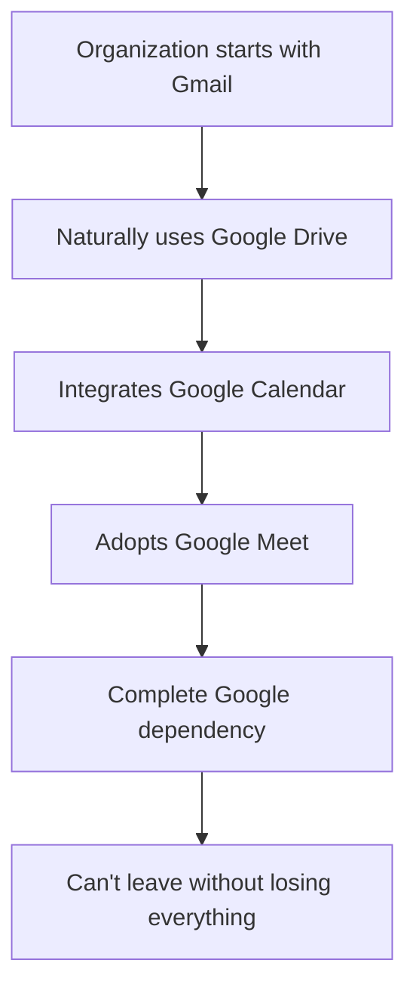

# The Google Drive Trap: Why Shared Folders Aren't Collective Ownership

## The Illusion of Collective Work

Google Drive feels revolutionary. Everyone can edit! Real-time collaboration! Version history! Access from anywhere! But beneath this appealing surface lies a trap that undermines everything revolutionary organizations stand for.

## The Material Reality

### Who Actually Owns "Your" Documents?

When you create a document in Google Drive, you don't own it. Google does. This isn't metaphorical - it's legally true:

```
Traditional ownership: You write → You own → You control
Google Drive reality: You write → Google owns → Google controls
```

The terms of service make this clear: Google can access, scan, modify, and delete your content. They can share it with governments. They can use it to train AI. They can lock you out instantly.

### The Single Point of Failure

**The Account Holder Becomes a Bottleneck**:

```
Revolutionary ideal: Collective ownership, distributed power
Google Drive reality: 
  └── Organization Account (single point of control)
      ├── If account suspended: Everything gone
      ├── If password compromised: Everything exposed
      ├── If member leaves: Scramble to transfer
      └── If Google decides: No recourse
```

Real example: In 2021, Google suspended an entire mutual aid network's account for "terms violation" (they shared information about protests). Years of organizing documents - gone. No appeal succeeded.

### The Surveillance Architecture

Every keystroke in Google Docs is logged:

```python
# What Google actually stores:
{
  "document_id": "abc123",
  "user": "organizer@riseup.net",
  "timestamp": "2024-03-20T19:43:21Z",
  "action": "typed",
  "content": "direct action planned for",
  "location": "40.7128,-74.0060",
  "device": "iPhone12,1",
  "network": "CoffeeShopWiFi"
}
```

This isn't paranoia. Google's Jigsaw division explicitly partners with law enforcement. Project Maven uses Google tech for military targeting. Your organizing documents sit in the same infrastructure.

## The Collaboration Trap

### Real-Time Editing: Speed at What Cost?

Google Docs feels efficient because everyone edits simultaneously. But consider what this means:

1. **No Moment of Reflection**: Changes happen without review
2. **No Democratic Process**: Whoever types fastest wins
3. **No Preserved Dissent**: Minority positions overwritten instantly
4. **No Accountability**: Who changed what becomes muddy

### Version History: Memory with Amnesia

Google provides version history, but:

```
Git version history:
- Permanent (cryptographically guaranteed)
- Names attached to changes
- Reasons recorded in commits
- Can't be secretly altered

Google version history:
- Can be purged by Google
- Anonymous when account shared
- No context for changes
- Silently editable by Google
```

## The Permission Paradox

Google's permission system seems sophisticated:
- View only
- Comment
- Edit

But this creates hierarchies that mirror corporate structure:

```
Owner (dictatorial power)
  ├── Editors (trusted inner circle)
  ├── Commenters (second-class members)
  └── Viewers (passive consumers)
```

This isn't collective ownership - it's digital feudalism with modern aesthetics.

## The Accessibility Excuse

"But Google Drive is easy to use!" This argument mistakes familiarity for accessibility:

### What's Actually Accessible:
- One-click surveillance
- Corporate dependency
- Data colonialism
- Learned helplessness

### What's Presented as "Difficult":
- Git (actually learnable in days)
- Self-hosted solutions (one-time setup)
- Distributed ownership (requires trust)
- Revolutionary discipline (requires commitment)

The real question: Is temporary convenience worth permanent surveillance?

## The Network Effects Prison

Google Drive seems free, but you pay with dependence:



Each additional Google service raises the exit cost. This is intentional - it's called a "walled garden" strategy.

## Real Organizations, Real Consequences

### Case Study 1: Climate Activists
- Used Google Docs for action planning
- Google AI flagged "suspicious activity"
- Account suspended before major action
- Years of research lost
- Organizers doxxed through connected accounts

### Case Study 2: Tenant Union
- Stored member information in Sheets
- Landlord's lawyer subpoenaed Google
- Google complied without resistance
- Tenant organizers faced retaliation
- Union collapsed from exposure

### Case Study 3: Labor Organizers
- Coordinated strike in Google Docs
- Company IT found the document
- (Google Workspace shows access logs)
- Key organizers fired before action
- Union drive failed

## The False Security of Encryption

"But Google encrypts data in transit and at rest!"

This misunderstands threat models:

```
Encryption against: Random hackers ✓
Encryption against: Google themselves ✗
Encryption against: Government requests ✗
Encryption against: AI training ✗
Encryption against: Behavioral analysis ✗
```

Google holds the encryption keys. It's like locking your door but giving the key to the landlord, the police, and anyone the landlord likes.

## The Psychology of Surrender

Google Drive trains learned helplessness:

1. **Complex tasks seem easy** (because Google does them)
2. **Simple tasks seem hard** (because they require agency)
3. **Corporate mediation feels natural**
4. **Self-determination feels impossible**

This isn't accidental. Every UX decision nudges toward dependency.

## Why This Matters

The tools we use shape our organizing:

### Google Drive Organizing:
- Centralized (like capitalism)
- Surveilled (like a police state)
- Hierarchical (like corporations)
- Fragile (single point of failure)
- Dependent (on corporate goodwill)

### Git-Based Organizing:
- Distributed (like revolutionary cells)
- Private (cryptographically secured)
- Democratic (merge by consensus)
- Resilient (no single point of failure)
- Independent (self-hosted/distributed)

## The Historical Pattern

This isn't new. Capital has always offered convenient tools that increase dependency:

- Company stores → Workers dependent on bosses
- Facebook Groups → Movements dependent on Zuckerberg
- Google Drive → Organizations dependent on Alphabet

Each generation must recognize and reject these traps.

## Breaking Free

The alternative isn't technically harder - it's politically different:

### Immediate steps:
1. Export all Google Docs to local files
2. Set up Git repository for documents
3. Train members on basic Git
4. Celebrate independence

### The revelation:
After two weeks, organizations report:
- "We can work offline!"
- "Our history is preserved!"
- "Decisions have context!"
- "No more account anxiety!"

## The Real Challenge

The barrier isn't technical - it's psychological. We've been trained to believe:

- Convenience requires surveillance
- Collaboration requires corporate mediation
- Ease requires dependence

These are lies. Revolutionary organizations deserve tools that embody their values:

- **Collective ownership** (actual, not simulated)
- **Democratic process** (built-in, not bolted-on)
- **Historical memory** (permanent, not erasable)
- **Security culture** (structural, not optional)

## A Future Beyond Digital Feudalism

Imagine organizing where:
- Documents can't be disappeared
- History can't be rewritten  
- Access can't be revoked by a corporation
- Surveillance isn't the price of collaboration

This isn't utopian. It's Git. It exists now. The only barrier is the decision to break free from the convenient trap of Google Drive.

## The Choice

Every organization faces this choice:

**Easy dependence** or **Revolutionary independence**

Google Drive offers the first. DRUIDS enables the second.

The question isn't whether you can learn Git. The question is whether you can afford to keep trusting Google with your revolutionary future.

Remember: Google's CEO sits on the Pentagon's Defense Innovation Board. Every document in Drive strengthens their surveillance apparatus. Every organization that breaks free weakens it.

*"The master's tools will never dismantle the master's house."* - Audre Lorde

Google Drive is the master's tool, perfected. Git is the tool we sharpen for liberation.