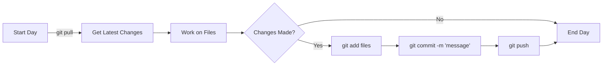
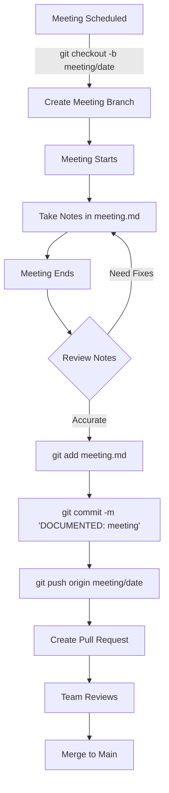
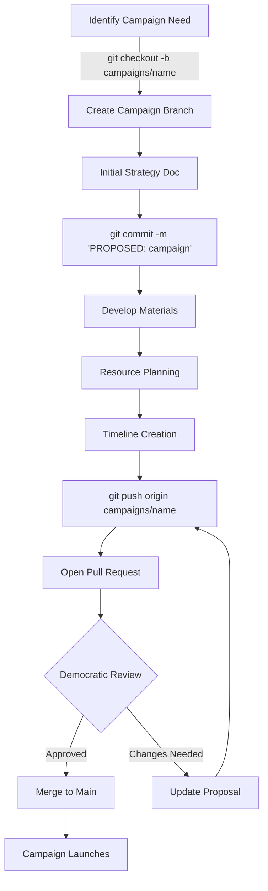
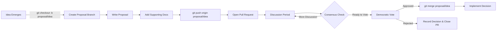
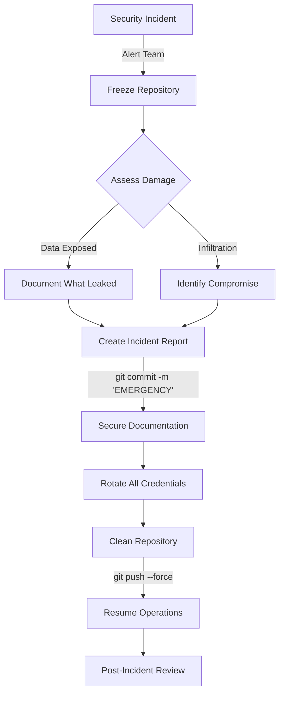
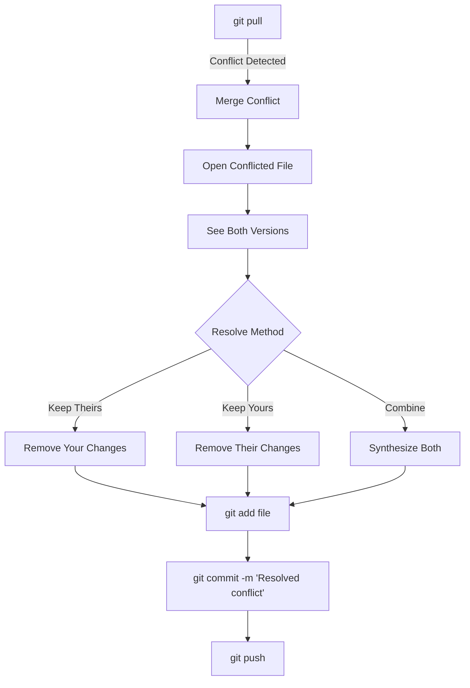
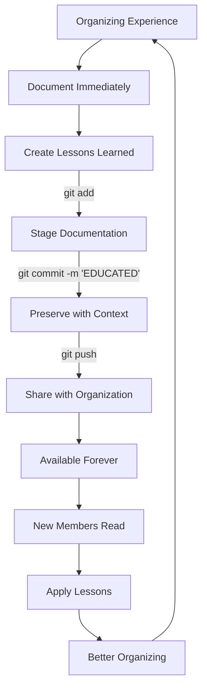
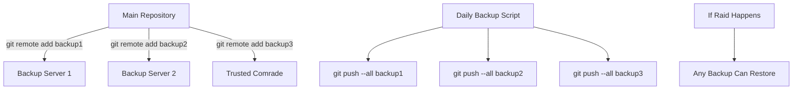

# Visual Git Workflows for Revolutionary Organizing

*Visual learners: These diagrams show how Git workflows support organizing work.*

**New to Git?** Start with [[git-isnt-programming|Git Isn't Programming]] then [[git-in-7-commands|Git in 7 Commands]]

**Need command references?** See [[git-quick-reference|Quick Reference]] or [[git-command-reference-card|Command Card]]

## Basic Daily Workflow

### ASCII Version
```
Morning                    During Day                 Evening
   │                          │                          │
   ▼                          ▼                          ▼
┌──────┐                 ┌─────────┐              ┌──────────┐
│ PULL │                 │ WORK &  │              │ COMMIT & │
│      │ ───────────────▶│ EDIT    │─────────────▶│ PUSH     │
└──────┘                 └─────────┘              └──────────┘
   │                          │                          │
   │                          │                          │
   ▼                          ▼                          ▼
"git pull"              "edit files"            "git add ."
                                               "git commit -m"
                                               "git push"
```

### Mermaid Version


## Meeting Documentation Flow

### ASCII Version
```
BEFORE MEETING          DURING MEETING          AFTER MEETING
      │                       │                      │
      ▼                       ▼                      ▼
┌─────────────┐        ┌─────────────┐       ┌─────────────┐
│   Create    │        │    Take     │       │   Commit    │
│   Branch    │───────▶│    Notes    │──────▶│   & Push    │
└─────────────┘        └─────────────┘       └─────────────┘
      │                       │                      │
      ▼                       ▼                      ▼
"git checkout -b      "Edit meeting.md"      "git add meeting.md"
 meeting/2024-03-21"                         "git commit -m 'DOCUMENTED'"
                                            "git push origin"
```

### Mermaid Version


## Campaign Development Workflow

### ASCII Version
```
┌─────────────────────────────────────────────────────────────┐
│                     MAIN BRANCH                             │
└─────────────┬───────────────────────────┬──────────────────┘
              │                           │
              ▼                           │
        ┌───────────┐                     │
        │  Create   │                     │
        │  Campaign │                     │
        │  Branch   │                     │
        └─────┬─────┘                     │
              │                           │
              ▼                           │
        ┌───────────┐                     │
        │  Develop  │                     │
        │ Strategy  │                     │
        └─────┬─────┘                     │
              │                           │
              ▼                           │
        ┌───────────┐                     │
        │ Organize  │                     │
        │ Resources │                     │
        └─────┬─────┘                     │
              │                           │
              ▼                           │
        ┌───────────┐                     │
        │  Review   │                     │
        │    PR     │                     │
        └─────┬─────┘                     │
              │                           │
              ▼                           ▼
        ┌─────────────────────────────────────┐
        │         MERGE TO MAIN              │
        └────────────────────────────────────┘
```

### Mermaid Version


## Proposal Development Process

### ASCII Version
```
 INDIVIDUAL           COLLABORATIVE           DEMOCRATIC
    WORK                 REVIEW               DECISION
     │                      │                     │
     ▼                      ▼                     ▼
┌─────────┐           ┌─────────┐          ┌─────────┐
│ Branch  │           │   Push  │          │  Vote   │
│   &     │──────────▶│    &    │─────────▶│   &     │
│ Develop │           │   PR    │          │  Merge  │
└─────────┘           └─────────┘          └─────────┘
     │                      │                     │
Freedom to            Open discussion        Unity of
develop ideas         and feedback           action
```

### Mermaid Version


## Security Incident Response

### ASCII Version
```
INCIDENT DETECTED ──────▶ IMMEDIATE RESPONSE ──────▶ RECOVERY
       │                          │                      │
       ▼                          ▼                      ▼
┌─────────────┐           ┌──────────────┐      ┌──────────────┐
│   FREEZE    │           │   DOCUMENT   │      │   ROTATE     │
│    REPO     │           │   INCIDENT   │      │ CREDENTIALS  │
└─────────────┘           └──────────────┘      └──────────────┘
       │                          │                      │
"Notify team"            "git commit -m          "Update access"
"Stop pushes"            'EMERGENCY: incident'"  "Force push clean"
```

### Mermaid Version


## Conflict Resolution Workflow

### ASCII Version
```
CONFLICT DETECTED
      │
      ▼
┌─────────────┐
│  git pull   │ ◄──── "Merge conflict in strategy.md"
└──────┬──────┘
       │
       ▼
┌─────────────┐
│    EDIT     │ ◄──── Remove <<<< ==== >>>> markers
│    FILE     │       Keep best of both versions
└──────┬──────┘
       │
       ▼
┌─────────────┐
│  git add    │ ◄──── Mark as resolved
└──────┬──────┘
       │
       ▼
┌─────────────┐
│ git commit  │ ◄──── "Resolved conflict: incorporated both positions"
└─────────────┘
```

### Mermaid Version


## Knowledge Preservation Pattern

### ASCII Version
```
EXPERIENCE ───▶ DOCUMENTATION ───▶ PRESERVATION ───▶ FUTURE USE
    │                │                   │                │
    ▼                ▼                   ▼                ▼
Campaign        Write lessons       Commit to Git    New organizers
happens         learned doc         with context      read & learn

                              ┌─────────────┐
                              │ Git History │
                              │  Preserves  │
                              │ Everything  │
                              └─────────────┘
                                     │
                    ┌────────────────┼────────────────┐
                    ▼                ▼                ▼
                Successes        Failures      Decisions
                Preserved        Preserved     Preserved
```

### Mermaid Version


## Distributed Backup Workflow

### ASCII Version
```
                     MAIN REPO
                         │
        ┌────────────────┼────────────────┐
        ▼                ▼                ▼
   BACKUP 1         BACKUP 2         BACKUP 3
   Server A         Server B         Comrade C
        │                │                │
        │                │                │
   "git push        "git push        "git push
    backup1"         backup2"         backup3"
```

### Mermaid Version


## Quick Reference: Visual Command Flow

```
STATUS ──▶ ADD ──▶ COMMIT ──▶ PUSH
  │        │         │         │
  ▼        ▼         ▼         ▼
What's   Select    Save      Share
changed  changes   locally   with all

PULL ──▶ WORK ──▶ REPEAT
  │        │         │
  ▼        ▼         ▼
Get      Make      Daily
latest   changes   cycle
```

## Using These Diagrams

1. **Print and Post**: Put these on the wall during training
2. **Customize**: Adapt workflows to your organization
3. **Teach**: Use visual + verbal explanation together
4. **Practice**: Walk through diagrams while doing commands

Remember: Different comrades learn differently. These visuals complement hands-on practice and written guides.

*"A picture is worth a thousand words, but a good diagram is worth a thousand commits."*

**Ready to practice?** Try [[your-first-revolutionary-commit|Your First Revolutionary Commit]]

**Teaching others?** Use our [[git-through-campaign-template|Git Workshop Template]] with these visuals