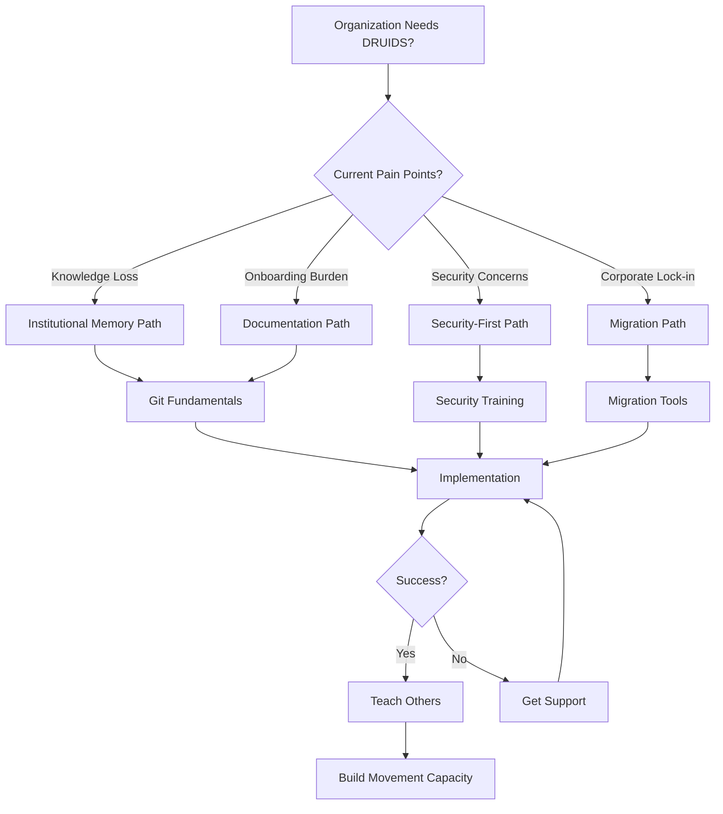

# Visual Learning Paths for Revolutionary Infrastructure

## Material Problem This Solves

Organizers approaching DRUIDS face overwhelming choices:
- Where do I start for my specific context?
- How long will each step take?
- What capacity must I build first?
- Which path serves my organization's needs?

Without clear roadmaps, comrades waste time on irrelevant features or miss crucial foundations.

## Political Framing

Traditional documentation assumes everyone follows the same path - a liberal fiction that ignores material conditions. Different organizing contexts require different approaches:
- **Labor unions** need security first
- **Tenant organizations** need migration tools
- **Study groups** need collaboration features
- **Direct action crews** need anonymity

These visual paths honor those differences while building toward collective liberation.

## The Core Journey

Every path follows the revolutionary cycle of **Practice → Theory → Practice**:

```
    START: Assessment
         ↓
    LEARN: Build Understanding  
         ↓
    IMPLEMENT: Put Into Practice
         ↓
    TEACH: Spread Capacity
         ↓
    [Return to START at higher level]
```

## Complete Learning Map

```
┌─────────────────────────────────────────────────────────────────┐
│                     DRUIDS LEARNING PATHS                        │
│                  "From Curiosity to Capacity"                    │
└─────────────────────────────────────────────────────────────────┘
                              │
                              ▼
┌─────────────────────────────────────────────────────────────────┐
│ START: "Is DRUIDS for Us?" (1-2 hours)                         │
├─────────────────────────────────────────────────────────────────┤
│ □ Read: Why DRUIDS?           → Understand problems we solve    │
│ □ Try: Quick Demo (5 min)     → See it in action              │
│ □ Assess: Current Pain Points → Map your needs to features     │
└─────────────────────────────────────────────────────────────────┘
                              │
            ┌─────────────────┴─────────────────┐
            ▼                                   ▼
┌─────────────────────────────┐     ┌─────────────────────────────┐
│ Path A: LABOR ORGANIZING    │     │ Path B: TENANT UNIONS       │
│ "High Security Needs"       │     │ "Migration Focus"           │
├─────────────────────────────┤     ├─────────────────────────────┤
│ 1. Security First (1 week)  │     │ 1. Migration (2 weeks)      │
│ 2. Git Basics (2 weeks)     │     │ 2. Collaboration (1 week)   │
│ 3. Deployment (1 month)     │     │ 3. Security (2 weeks)       │
└─────────────────────────────┘     └─────────────────────────────┘
            │                                   │
            └─────────────────┬─────────────────┘
                              ▼
┌─────────────────────────────────────────────────────────────────┐
│ LEARN: Core Concepts (2-4 organizing cycles)                    │
├─────────────────────────────────────────────────────────────────┤
│ ► Institutional Memory    → Why we preserve knowledge           │
│ ► Security as Practice    → Protection through politics         │
│ ► Democratic Centralism   → Unity in action, freedom in debate  │
│ ► Git Fundamentals        → Version control for organizers      │
└─────────────────────────────────────────────────────────────────┘
                              │
                              ▼
┌─────────────────────────────────────────────────────────────────┐
│ IMPLEMENT: Making It Real (1-3 months)                          │
├─────────────────────────────────────────────────────────────────┤
│ Week 1-2:   Install & Configure                                 │
│ Week 3-4:   Migrate Existing Work                              │
│ Week 5-8:   Establish Workflows                                │
│ Week 9-12:  Advanced Features                                  │
└─────────────────────────────────────────────────────────────────┘
                              │
                              ▼
┌─────────────────────────────────────────────────────────────────┐
│ TEACH: Building Collective Capacity                             │
├─────────────────────────────────────────────────────────────────┤
│ → Run Git workshops for your organization                       │
│ → Create documentation for your workflows                       │
│ → Train workshop facilitators                                   │
│ → Build support networks                                        │
└─────────────────────────────────────────────────────────────────┘
```

**[EXPAND HERE: Add ASCII art paths specific to your movement sectors]**

## Detailed Path: Labor Organizing

For unions facing heavy surveillance and infiltration:

```
START: Security Assessment (1 day)
│
├─→ Read: "When They Come Knocking" 
│   └─→ Understand state repression tactics
│
├─→ Workshop: Threat Modeling (2 hours)
│   └─→ Map your specific vulnerabilities
│
└─→ Decision: Security Level Needed
    └─→ L1 (Members) or L2 (Leadership)?

LEARN: Security First (1 week)
│
├─→ Day 1-2: Security as Revolutionary Practice
│   └─→ Political education on security culture
│
├─→ Day 3-4: DRUIDS Security Implementation  
│   └─→ Technical security measures
│
├─→ Day 5-6: Metadata & Anonymity
│   └─→ Protecting member identities
│
└─→ Day 7: Security Audit Practice
    └─→ Check your implementation

[Continue with Git, Implementation, Teaching phases...]
```

**[EXPAND HERE: Complete the labor organizing path with specific timelines]**

## Detailed Path: Tenant Unions

For organizations escaping corporate surveillance:

```
START: Liberation Assessment (2 hours)
│
├─→ Inventory: Current Corporate Tools
│   └─→ List Google, Discord, Facebook use
│
├─→ Calculate: Data Extraction Needs
│   └─→ What must be preserved?
│
└─→ Plan: Migration Timeline
    └─→ Can't switch overnight!

LEARN: Migration Strategy (3 days)
│
├─→ Day 1: Why Corporate Tools Fail Us
│   ├─→ Read: "Google Drive Trap"
│   └─→ Read: "Discord Democracy Fails"
│
├─→ Day 2: Migration Methodology
│   ├─→ From Google Docs guide
│   └─→ From Discord guide
│
└─→ Day 3: Pilot Planning
    └─→ Choose test group

[Continue with implementation phases...]
```

**[EXPAND HERE: Build out tenant union path with practical steps]**

## Mermaid Diagram: Technology Decision Tree



**[EXPAND HERE: Add decision trees for your specific contexts]**

## Time Estimates in Organizing Cycles

We measure time in **organizing cycles** not hours, because revolutionary work happens between meetings, actions, and campaigns:

| Phase | Calendar Time | Organizing Cycles | Real Example |
|-------|--------------|-------------------|--------------|
| START | 1-2 hours | 1 meeting | "We discussed at Tuesday's meeting" |
| LEARN | 2-4 weeks | 2-3 cycles | "Studied between June actions" |
| IMPLEMENT | 1-3 months | 1 campaign | "Rolled out during rent strike" |
| TEACH | Ongoing | Every cycle | "Each new member learns" |

**[EXPAND HERE: Add your organization's typical cycle timing]**

## Prerequisites Map

Visual representation of capacity building:

```
Foundation Skills (Required for All Paths)
├─→ Basic Computer Literacy
│   └─→ Can use email, web browser
│
├─→ Political Consciousness  
│   └─→ Understand need for independence
│
└─→ Collective Commitment
    └─→ Group decision to adopt

Path-Specific Prerequisites
│
├─→ SECURITY PATH
│   ├─→ Threat awareness
│   └─→ Discipline commitment
│
├─→ MIGRATION PATH
│   ├─→ Admin access to current tools
│   └─→ Complete data inventory
│
└─→ COLLABORATION PATH
    ├─→ Existing workflows mapped
    └─→ Team coordination skills
```

**[EXPAND HERE: Detail prerequisites for your contexts]**

## Success Indicators by Stage

Know you're ready to advance when:

### START → LEARN
- [x] Can articulate why DRUIDS serves your organizing
- [x] Have tried the demo
- [x] Identified 3+ specific pain points to solve
- [x] Have collective buy-in to proceed

### LEARN → IMPLEMENT  
- [x] Understand core concepts (can explain to others)
- [x] Completed Git basics without fear
- [x] Know which security level you need
- [x] Have implementation plan written

### IMPLEMENT → TEACH
- [x] Successfully using DRUIDS for real work
- [x] Solved at least one major pain point
- [x] Have documented your workflows
- [x] Other members asking to learn

**[EXPAND HERE: Add success indicators from your experience]**

## Alternative Paths for Different Contexts

### Path C: Direct Action Crews (Maximum Security)
```
START → L2 Security → Anonymous Git → Encrypted Deployment → Cell Teaching
Timeline: 2-3 months of careful implementation
```

### Path D: Study Groups (Collaboration Focus)
```
START → Git Basics → Shared Workflows → Simple Security → Peer Teaching  
Timeline: 3-4 weeks of collective learning
```

### Path E: Emergency Response (Rapid Deployment)
```
START → Minimum Viable Security → Basic Git → Quick Migration → Learn as You Go
Timeline: 1 week sprint, then iterate
```

**[EXPAND HERE: Design paths for your movement's diverse needs]**

## Visual Learning Styles

Different comrades learn differently. Provide multiple formats:

1. **Linear Learners**: Step-by-step paths above
2. **Visual Learners**: Diagrams and flowcharts
3. **Hands-On Learners**: Jump to Quick Demo
4. **Theory-First Learners**: Start with Philosophy
5. **Problem-Solvers**: Begin with pain points

## Tracking Progress

Create visual progress tracker for your organization:

```
DRUIDS Journey Tracker - [Organization Name]
━━━━━━━━━━━━━━━━━━━━━━━━━━━━━━━━━━━━━━━━

START:    [████████████] 100% Complete ✓
LEARN:    [████████░░░░] 66% In Progress
IMPLEMENT:[██░░░░░░░░░░] 15% Beginning
TEACH:    [░░░░░░░░░░░░] 0% Not Started

Current Focus: Learning Git fundamentals
Next Milestone: First real repository
Blockers: Need 2 more laptops for members
```

**[EXPAND HERE: Create tracker template for your group]**

## Remember

These paths are **suggestions, not prescriptions**. Your material conditions determine your journey. The map is not the territory - adapt based on your organizing reality.

Every organization's path is valid. The goal isn't perfection but progress toward collective liberation.

---

**Ready to start your journey?** Begin with [[../start/why-druids|Why DRUIDS?]]

**Need help choosing a path?** Check [[../start/index|For Organizers]] for context-specific guidance.

**Want to contribute a path?** Follow our [[../contributing/cross-reference-guide|Cross-Reference Guide]] to add your journey.