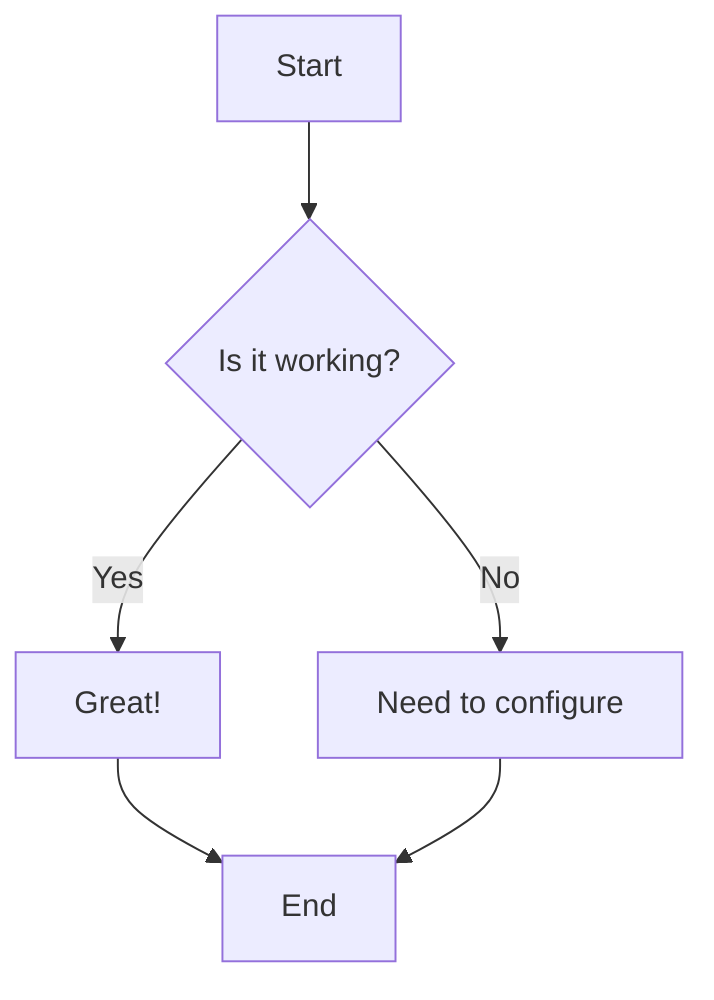

# Testing Markdown Extensions

This page tests various markdown extensions to see what's already working.

## Mermaid Diagrams



## Admonitions / Callouts

!!! note "This is a note"
    Testing if admonitions work with the current setup.

!!! warning "Warning"
    This is a warning admonition.

!!! danger "Danger"
    This is a danger admonition.

!!! tip "Pro tip"
    This is a tip admonition.

!!! info "Information"
    This is an info admonition.

??? question "Collapsible question"
    This is a collapsible admonition.

## Code Blocks with Syntax Highlighting

```python title="test.py"
def hello_world():
    """Test function with syntax highlighting"""
    print("Hello, World!")
    return True

# Testing line numbers
for i in range(10):
    print(f"Line {i}")
```

```javascript title="app.js" linenums="1"
// JavaScript with line numbers
function testFunction() {
    console.log("Testing syntax highlighting");
    const result = {
        status: "success",
        data: [1, 2, 3]
    };
    return result;
}
```

## Content Tabs

=== "Tab 1"
    This is the content of tab 1.
    
    ```python
    print("Tab 1 code")
    ```

=== "Tab 2"
    This is the content of tab 2.
    
    ```javascript
    console.log("Tab 2 code");
    ```

=== "Tab 3"
    This is the content of tab 3.

## Data Tables

| Feature | Status | Priority |
|---------|--------|----------|
| Mermaid | Testing | High |
| Admonitions | Testing | High |
| Code Blocks | Testing | High |
| Tables | Testing | Medium |

## Footnotes

Here's a sentence with a footnote[^1].

And here's another one[^2].

[^1]: This is the first footnote.
[^2]: This is the second footnote with more content.

## Task Lists

- [x] Create test page
- [x] Add Mermaid diagram
- [ ] Test admonitions
- [ ] Test code blocks
- [ ] Verify all features

## Math (LaTeX)

Inline math: $x^2 + y^2 = z^2$

Block math:

$$
\frac{n!}{k!(n-k)!} = \binom{n}{k}
$$

## Icons and Emojis

- :material-check: Material icon check
- :material-close: Material icon close
- :material-github: GitHub icon
- :octicons-check-16: Octicons check
- 😀 Regular emoji
- 🚀 Rocket emoji

## Annotations

This is text with an annotation(1).
{ .annotate }

1. This is the annotation content that appears when clicked.

## Buttons

[Subscribe to our newsletter](#){ .md-button }

[Subscribe to our newsletter](#){ .md-button .md-button--primary }

## Grids

<div class="grid cards" markdown>

- :material-clock-fast:{ .lg .middle } __Set up in 5 minutes__

    ---

    Install with pip and get up and running in minutes

    [:octicons-arrow-right-24: Getting started](#)

- :material-scale-balance:{ .lg .middle } __It's just Markdown__

    ---

    Focus on your content and let Material do the rest

    [:octicons-arrow-right-24: Learn more](#)

</div>

## Images with Captions

{ align=left width=300 }

Lorem ipsum dolor sit amet, consectetur adipiscing elit. This text should wrap around the image.

## Tooltips

This is text with a tooltip[Hover over me to see the tooltip](# "This is the tooltip content").

## Formatting

==This text is highlighted==

^^This text is superscript^^

~~This text is strikethrough~~

{--This text is deleted--}

{++This text is inserted++}

{~~wrong~>right~~}

## Definition Lists

Apple
:   A fruit that grows on trees

Orange
:   A citrus fruit that is orange in color
:   Also a color

## Abbreviations

The HTML specification is maintained by the W3C.

*[HTML]: Hyper Text Markup Language
*[W3C]: World Wide Web Consortium

## Keyboard Keys

Press ++ctrl+alt+del++ to restart.

## SmartSymbols

(c) (tm) (r) --> <-- <--> =/= 1/4 1/2 3/4

## Obsidian Features

### Wikilinks

- Basic wikilink: [index](index.md)
- Wikilink with custom text: [Home Page](index.md)
- Wikilink to non-existent page: [does-not-exist](does-not-exist.md)

### Callouts (Obsidian style)

> [!note]
> This is an Obsidian-style callout

> [!warning]
> This is a warning callout

> [!tip]
> This is a tip callout