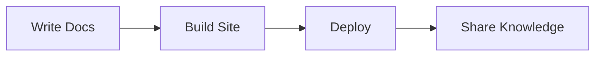

# Features Demo

This page demonstrates the key features available in our MkDocs setup.

## Content Features

### Code Blocks

With syntax highlighting, line numbers, and annotations:

```python title="example.py" linenums="1" hl_lines="2"
def greet(name):
    print(f"Hello, {name}!")  # (1)
    return True
```

1. This is a code annotation - click the plus sign!

### Admonitions

!!! note "Information"
    Callout boxes for important information.

!!! warning "Caution"
    Warnings stand out with distinct styling.

!!! tip "Pro Tip"
    Share helpful tips and best practices.

??? info "Collapsible Content"
    This content can be expanded/collapsed.

### Tables

| Feature | Description | Status |
|---------|------------|--------|
| Search | Full-text search | ✅ Active |
| Comments | GitHub Discussions | ✅ Active |
| Offline | PWA support | ✅ Active |
| Versioning | Multi-version docs | ⚙️ Optional |

### Task Lists

- [x] Basic Markdown support
- [x] Extended syntax features
- [x] Code highlighting
- [ ] Your custom features

### Tabs

=== "Python"
    ```python
    print("Hello, Python!")
    ```

=== "JavaScript"
    ```javascript
    console.log("Hello, JavaScript!");
    ```

=== "Bash"
    ```bash
    echo "Hello, Bash!"
    ```

## Advanced Features

### Mermaid Diagrams



### Math Support

Inline math: $a^2 + b^2 = c^2$

Block equations:

$$
\frac{n!}{k!(n-k)!} = \binom{n}{k}
$$

### Footnotes

You can add footnotes[^1] to provide additional context.

[^1]: This is a footnote with extra information.

### Keyboard Keys

Use keyboard shortcuts: ++ctrl+s++ to save, ++cmd+c++ to copy.

### Icons

Material icons: :material-home: :material-github: :material-heart:

FontAwesome icons: :fontawesome-brands-github: :fontawesome-solid-code:

## Interactive Features

### Search

- Press ++ctrl+k++ or ++cmd+k++ to open search
- Search highlights results
- Instant search suggestions

### Navigation

- Instant page loading
- Progress indicator
- Breadcrumb navigation
- Sticky table of contents

### Comments

This page has comments enabled - scroll down to participate in the discussion!

### Offline Support

Once you visit this site, it works offline thanks to service worker caching.

## Wikilinks (Obsidian)

Internal links work with wikilink syntax:
- [[index|Home Page]]
- [[customization-guide|Customize Your Site]]
- [[setup-giscus|Set Up Comments]]

## Page Metadata

This page includes:
- **Tags**: See them at the top
- **Comments**: Enabled via frontmatter
- **Description**: For SEO
- **Git info**: Last updated time

---

_Try out these features in your own documentation!_
