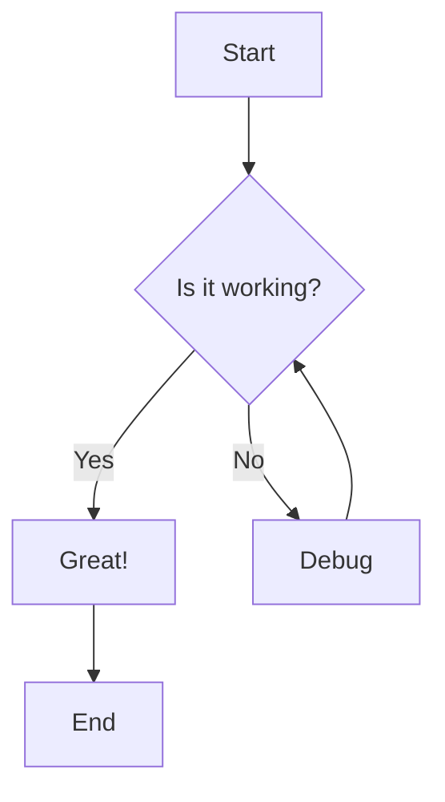

# MkDocs Material Features Demo

This page demonstrates all the configured features of your MkDocs Material setup.

## Comments System

Comments are enabled on this page using Giscus. Scroll to the bottom to see the comment section.

## Tags

This page is tagged with: `demo`, `features`, `material`

You can see all tags on the [Tags page](tags.md).

## Social Cards

When shared on social media, this page will generate a custom social card with the site branding.

## Code Blocks with Features

```python title="example.py" linenums="1" hl_lines="2 3"
def hello_world():
    print("Hello, World!")  # (1)
    return "success"
```

1. This is a code annotation!

## Mermaid Diagrams



## Math Support

Inline math: $E = mc^2$

Block math:

$$
\int_{-\infty}^{\infty} e^{-x^2} dx = \sqrt{\pi}
$$

## Admonitions

!!! note "This is a note"
This demonstrates the admonition feature.

!!! warning "Important"
This is a warning admonition.

!!! tip "Pro Tip"
You can use different types of admonitions.

## Task Lists (Obsidian Compatible)

- [x] Set up MkDocs Material
- [x] Configure all plugins
- [x] Add Giscus comments
- [ ] Customize theme colors
- [ ] Add more content

## Tabs

=== "Python"

    ```python
    print("Hello from Python!")
    ```

=== "JavaScript"

    ```javascript
    console.log("Hello from JavaScript!");
    ```

=== "Bash"

    ```bash
    echo "Hello from Bash!"
    ```

## Footnotes

This text has a footnote[^1].

[^1]: This is the footnote content.

## Keyboard Keys

Press ++ctrl+alt+del++ to restart.

Use ++cmd+c++ to copy on Mac.

## Critic Markup

Text can be {--deleted--} and {++added++}. You can also {~~substitute~>replace~~} text and {==highlight==} important parts. {>>Comments can be added inline<<}.

## Details/Collapsible Sections

??? note "Click to expand"
This content is hidden by default and can be expanded.

??? question "FAQ Item"
This is how you can create FAQ sections.

## Icons and Emojis

:material-heart: :material-star: :fontawesome-solid-rocket:

:smile: :thumbsup: :fire:

## Tables

| Feature      | Status | Notes              |
| ------------ | ------ | ------------------ |
| Comments     | ✅     | Giscus integration |
| Social Cards | ✅     | Auto-generated     |
| Tags         | ✅     | Fully configured   |
| Offline      | ✅     | PWA support        |
| Search       | ✅     | Enhanced search    |

## Navigation Features

- **Instant loading** - Pages load instantly
- **Progress indicator** - Shows loading progress
- **Back to top** - Scroll to top button
- **Navigation tabs** - Sticky navigation
- **Table of contents** - Auto-generated TOC

## Footer

The footer includes:

- Social links
- Copyright information
- Privacy policy links
- Cookie consent

## Offline Support

This site works offline once visited, thanks to the Material offline plugin.

---

_This page demonstrates the comprehensive MkDocs Material setup with Obsidian compatibility._
