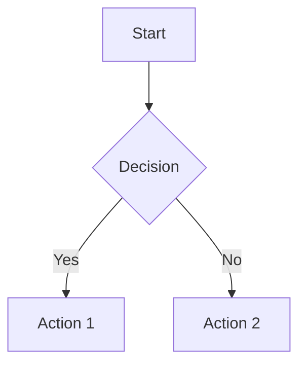

# Getting Started Guide

Welcome! This guide will help you understand how to navigate, use, and contribute to this knowledge base.

## Understanding the Structure

### File Organization

```
docs/
├── index.md              # Homepage
├── getting-started.md    # This guide
├── concepts/            # Core concepts
├── tutorials/           # Step-by-step guides
├── reference/           # Technical documentation
└── assets/             # Images, CSS, JS
```

### Navigation

- **Sidebar**: Browse all sections and pages
- **Search**: Use the search bar (Ctrl/Cmd + K)
- **Breadcrumbs**: See your current location
- **Table of Contents**: Navigate within pages

## Working with Content

### Markdown Basics

This knowledge base uses enhanced Markdown with special features:

#### Headers

```markdown
# H1 Header
## H2 Header
### H3 Header
```

#### Links

```markdown
[External link](https://example.com)
[[Internal wikilink]]
[[Link with custom text|Custom Text]]
```

#### Code Blocks

````markdown
```python
def hello_world():
    print("Hello, World!")
```
````

#### Admonitions

```markdown
!!! note "Important Note"
    This is a callout box that draws attention.

!!! warning
    This is a warning message.

!!! tip "Pro Tip"
    This is a helpful tip.
```

### Advanced Features

#### Math Equations

```markdown
Inline math: $E = mc^2$

Block math:
$$
\int_{-\infty}^{\infty} e^{-x^2} dx = \sqrt{\pi}
$$
```

#### Diagrams

````markdown

````

#### Tables

```markdown
| Feature | Status | Notes |
|---------|--------|-------|
| Search  | ✅     | Full-text |
| Mobile  | ✅     | Responsive |
| Offline | ❌     | Planned |
```

## Content Creation

### Using Templates

We provide templates for common content types:

- **[[Note Template]]**: Standard note format
- **[[Tutorial Template]]**: Step-by-step guides
- **[[Reference Template]]**: Technical documentation
- **[[Project Template]]**: Project documentation

### Best Practices

#### Writing Guidelines

1. **Clear Titles**: Use descriptive, searchable titles
2. **Consistent Structure**: Follow established patterns
3. **Rich Linking**: Connect related concepts
4. **Tag Appropriately**: Use relevant tags for discovery

#### Frontmatter Standards

```yaml
---
title: Page Title
description: Brief description for SEO
tags:
  - category
  - topic
  - type
date: 2024-01-01
author: Your Name
---
```

#### Linking Strategy

- **Use wikilinks** for internal content: `[[Page Name]]`
- **Link early and often** to build connections
- **Create hub pages** for major topics
- **Use descriptive link text** for external links

## Collaboration

### Contributing Content

1. **Create new notes** in appropriate folders
2. **Follow naming conventions**: `kebab-case-titles.md`
3. **Add proper frontmatter** with metadata
4. **Link to related content** using wikilinks
5. **Test locally** before publishing

### Review Process

- All changes are reviewed via pull requests
- Check for broken links and formatting
- Ensure content follows style guidelines
- Verify all images and assets load correctly

## Technical Setup

### Local Development

```bash
# Clone the repository
git clone https://github.com/yourusername/your-repo.git
cd your-repo

# Install dependencies
uv sync

# Start development server
uv run mkdocs serve

# Build for production
uv run mkdocs build
```

### Configuration

The site is configured via `mkdocs.yml`:

- **Theme settings**: Colors, fonts, features
- **Plugin configuration**: Search, navigation, etc.
- **Markdown extensions**: Enhanced syntax support
- **Custom CSS/JS**: Additional styling and functionality

## Troubleshooting

### Common Issues

#### Broken Links

- Check spelling and case sensitivity
- Ensure target files exist
- Use relative paths for internal links

#### Images Not Loading

- Verify image paths are correct
- Check file permissions
- Ensure images are in the `assets/images/` folder

#### Build Failures

- Check YAML frontmatter syntax
- Validate Markdown formatting
- Review error messages in build logs

### Getting Help

- Check the [[FAQ]] for common questions
- Search existing [[Issues]] on GitHub
- Create a new issue with detailed information
- Join our community discussions

## Next Steps

Now that you understand the basics:

1. **Explore existing content** to see examples
2. **Try creating your first note** using a template
3. **Experiment with different features** like math and diagrams
4. **Join the community** and start contributing

Happy documenting! 🚀

---

_Need more help? Check out our [[Advanced Features]] guide or [[FAQ]]._
