# Mermaid Debug Test Page

This page contains various test cases to debug Mermaid rendering and code block overflow issues.

## Test 1: Simple Flowchart

**Expected**: Rendered flowchart diagram with dark theme colors
**Current Status**: [TO BE DOCUMENTED]


## Test 2: Sequence Diagram

**Expected**: Rendered sequence diagram with participants and messages
**Current Status**: [TO BE DOCUMENTED]


## Test 3: State Diagram

**Expected**: Rendered state diagram with transitions
**Current Status**: [TO BE DOCUMENTED]


## Test 4: Long Code Block (Test Horizontal Overflow)

**Expected**: Code block should not cut off content horizontally
**Current Status**: [TO BE DOCUMENTED]

```bash
# This is a very long command that should test horizontal scrolling behavior in code blocks
git log --oneline --graph --decorate --all --since="2 weeks ago" --pretty=format:"%C(yellow)%h%C(reset) - %C(green)(%cr)%C(reset) %s %C(bold blue)<%an>%C(reset)%C(red)%d%C(reset)"
```

```javascript
// Very long JavaScript line to test horizontal overflow
const veryLongVariableName = someVeryLongFunctionNameThatShouldCauseHorizontalScrolling('with', 'multiple', 'parameters', 'that', 'extend', 'beyond', 'normal', 'viewport', 'width');
```

## Test 5: Mixed Content (Mermaid + Code)

**Expected**: Both Mermaid diagram and code blocks render properly on same page
**Current Status**: [TO BE DOCUMENTED]

```mermaid
gitgraph
    commit id: "Initial"
    branch feature
    checkout feature
    commit id: "Feature work"
    checkout main
    commit id: "Hotfix"
    merge feature
```

```python
# Python code after Mermaid diagram
def very_long_function_name_that_tests_horizontal_scrolling_behavior(parameter_one, parameter_two, parameter_three):
    """
    This function has a very long name and long parameters to test code block overflow.
    """
    return f"Result: {parameter_one}, {parameter_two}, {parameter_three}"
```

## Test 6: Complex Flowchart

**Expected**: Complex diagram with multiple node types and styling
**Current Status**: [TO BE DOCUMENTED]



```mermaid
flowchart TB
    subgraph "Security Tiers"
        L0[L0: Public<br/>🟢 Green]
        L1[L1: Member<br/>🟤 Brown]
        L2[L2: Cadre<br/>🔴 Red]
    end

    subgraph "Access Control"
        AC1[Git Repository]
        AC2[Visual Indicators]
        AC3[Document Classification]
    end

    L0 --> AC1
    L1 --> AC1
    L2 --> AC1
    AC1 --> AC2
    AC2 --> AC3

    style L0 fill:#27AE60,stroke:#FFFFFF,color:#FFFFFF
    style L1 fill:#E67E22,stroke:#FFFFFF,color:#FFFFFF
    style L2 fill:#C0392B,stroke:#FFFFFF,color:#FFFFFF
```

## Browser Console Debug Info

When testing this page, check the browser console for:

1. **JavaScript Errors**: Any errors related to Mermaid.js loading or execution
2. **Network Requests**: Whether Mermaid.js library is successfully loaded
3. **CSP Violations**: Content Security Policy blocking script execution
4. **Rendering Warnings**: Any warnings from Mermaid about diagram syntax

### Console Commands to Run

```javascript
// Check if Mermaid is loaded
console.log('Mermaid loaded:', typeof window.mermaid !== 'undefined');

// Check Mermaid version
if (typeof window.mermaid !== 'undefined') {
    console.log('Mermaid version:', window.mermaid.version || 'version unknown');
}

// Check for any mermaid elements
console.log('Mermaid elements found:', document.querySelectorAll('.mermaid').length);

// Check for any error classes
console.log('Error elements:', document.querySelectorAll('.mermaid-error').length);
```

## Expected CSS Classes

When Mermaid renders properly, we should see:

- `.mermaid` containers with SVG content
- No `.mermaid-error` classes
- SVG elements with proper styling from our custom CSS

## Test Results Template

For each test, document:

- ✅ **PASS**: Renders correctly
- ❌ **FAIL**: Does not render / Error
- ⚠️ **PARTIAL**: Renders but with issues

**Test 1 Flowchart**: ✅ PASS - Renders correctly with dark theme
**Test 2 Sequence**: ✅ PASS - Renders correctly  
**Test 3 State**: ✅ PASS - Renders correctly
**Test 4 Long Code**: ✅ FIXED - Horizontal scrolling now works
**Test 5 Mixed**: [RESULT]
**Test 6 Complex**: [RESULT]

## Debugging Notes

Document any findings here:

- Browser console errors:
- Network tab issues:
- CSS rendering problems:
- Plugin configuration issues:
