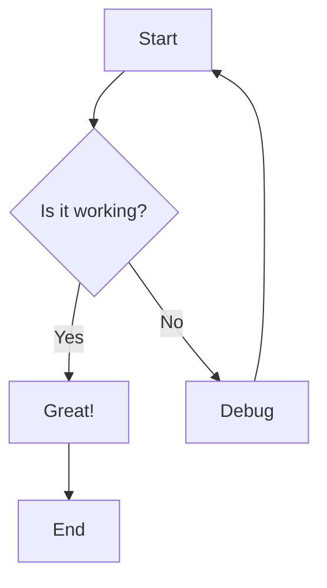
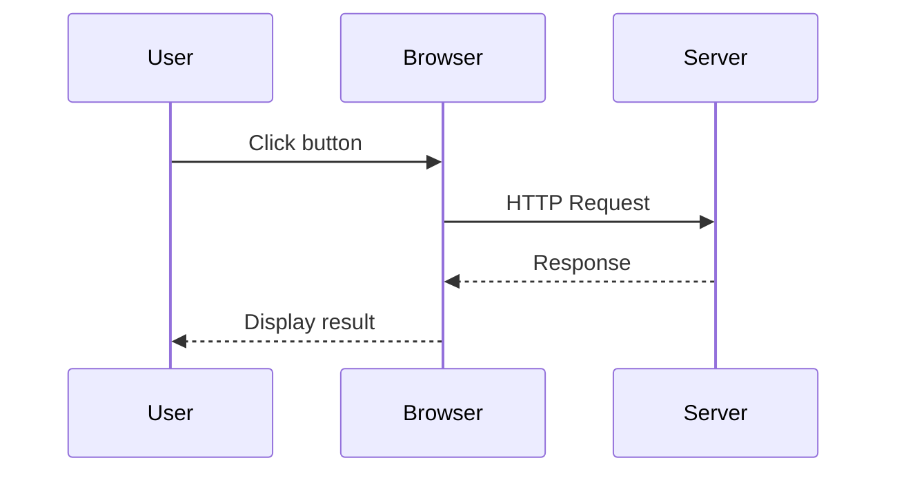
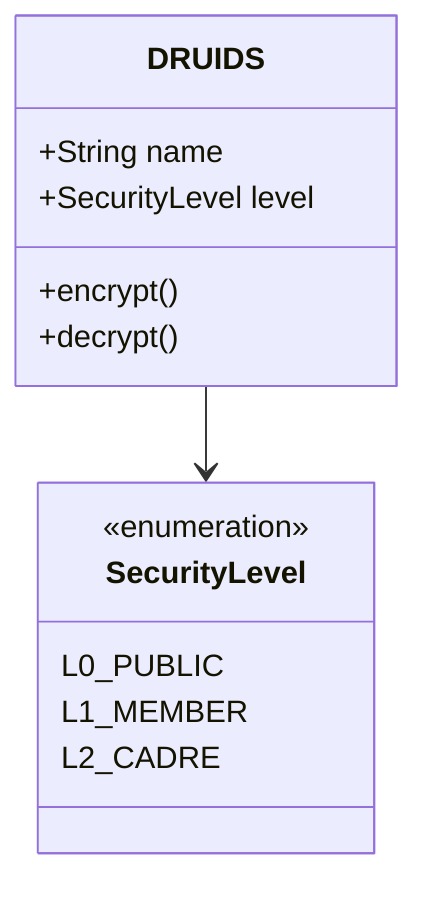
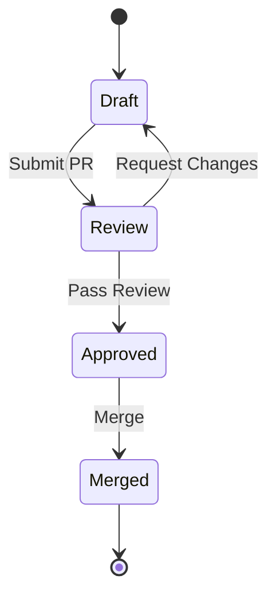
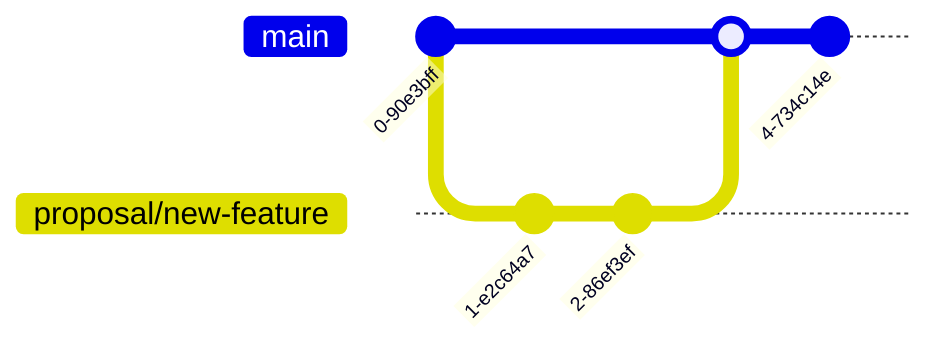
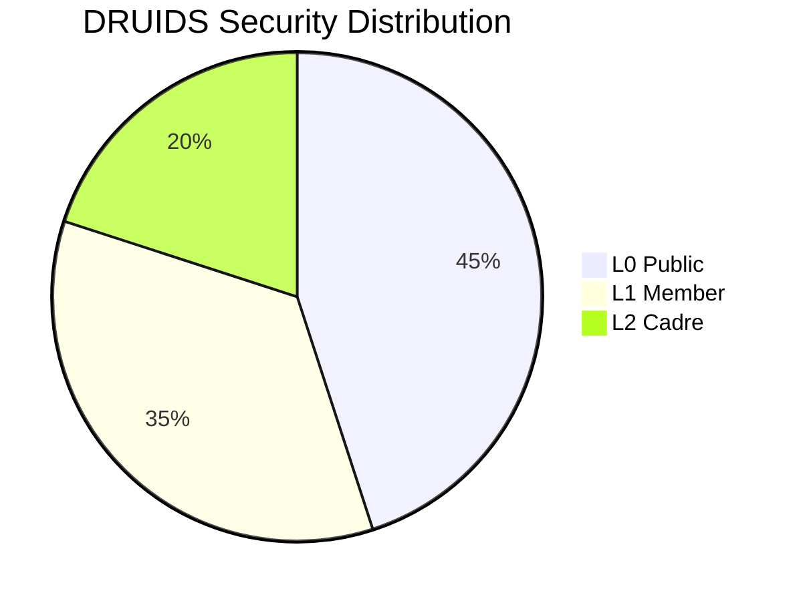

# Mermaid Diagram Test Page

This page tests various Mermaid diagram types to ensure they render correctly with the Mandalorian theme.

## Flowchart Example

## Sequence Diagram

## Class Diagram

## State Diagram

## Git Graph

## Pie Chart

