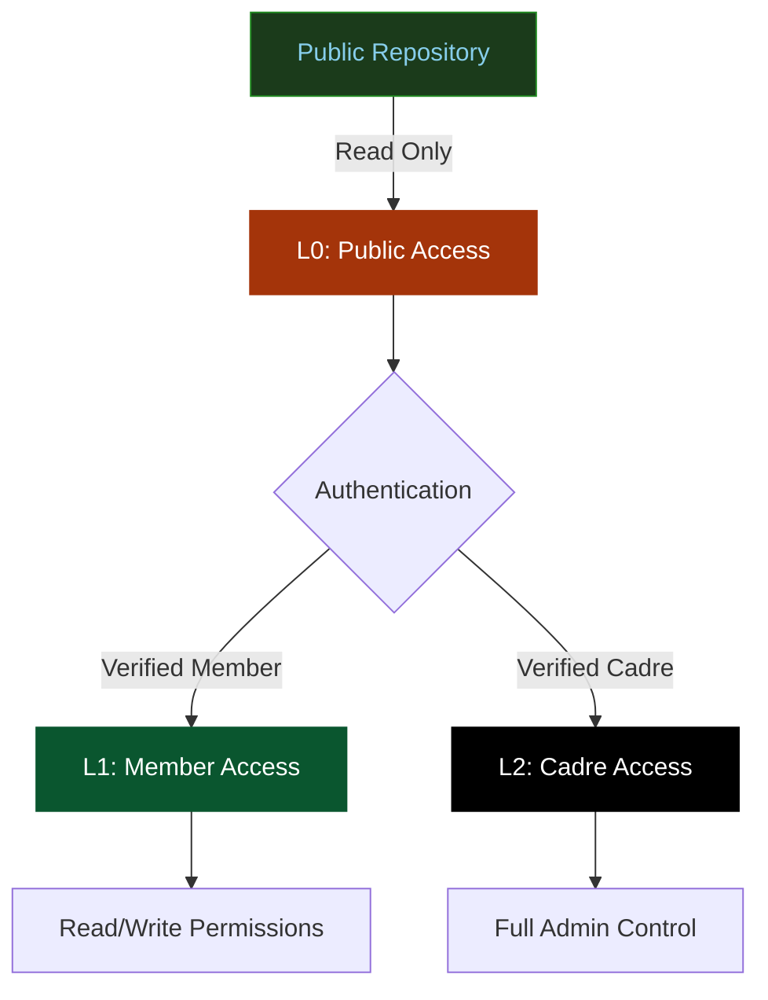

# Theme Test: Components & Elements

Testing tables, admonitions, and other UI components.

## Tables

### Simple Table

| Feature      | L0 Public | L1 Member | L2 Cadre |
| ------------ | --------- | --------- | -------- |
| Read Access  | ✓         | ✓         | ✓        |
| Write Access | ✗         | ✓         | ✓        |
| Admin Access | ✗         | ✗         | ✓        |
| Encryption   | ✗         | ✓         | ✓        |

### Complex Table with Alignment

| Command      | Description             |        Example         | Level |
| :----------- | :---------------------- | :--------------------: | ----: |
| `git status` | Check repository status |    `git status -s`     |    L0 |
| `git commit` | Commit changes          | `git commit -m "msg"`  |    L1 |
| `git push`   | Push to remote          | `git push origin main` |    L2 |
| `git rebase` | Rebase branches         | `git rebase -i HEAD~3` |    L2 |

## Admonitions

!!! note "Note Admonition"
This is a note with important information. Notes are used for general information that users should be aware of.

!!! tip "Pro Tip"
This is a helpful tip for users. Use keyboard shortcuts like `Ctrl+S` to save time.

!!! info "Information"
Additional context and background information goes here. This helps users understand the bigger picture.

!!! warning "Security Warning"
This is a warning about security considerations. Always verify GPG signatures before trusting commits.

!!! danger "Critical Security Alert"
Never commit sensitive information like API keys or passwords to version control!

!!! success "Success Message"
Operation completed successfully! Your environment is now configured correctly.

!!! question "Common Question"
**Q:** How do I configure multi-factor authentication?

    **A:** Navigate to Settings → Security → 2FA Setup

!!! quote "Revolutionary Quote" > "The revolution is not an apple that falls when it is ripe. You have to make it fall." > > — Che Guevara

## Security Badges

L0 Public
L1 Member
L2 Cadre

## Mermaid Diagrams

## Navigation Example

<nav class="md-nav" style="background: #1B3B1B; padding: 1rem; border-radius: 4px;">
  <ul class="md-nav__list">
    <li class="md-nav__item">
      <a href="#" class="md-nav__link">Getting Started</a>
    </li>
    <li class="md-nav__item md-nav__item--active">
      <a href="#" class="md-nav__link md-nav__link--active">Core Concepts</a>
    </li>
    <li class="md-nav__item">
      <a href="#" class="md-nav__link">Implementation</a>
    </li>
  </ul>
</nav>
