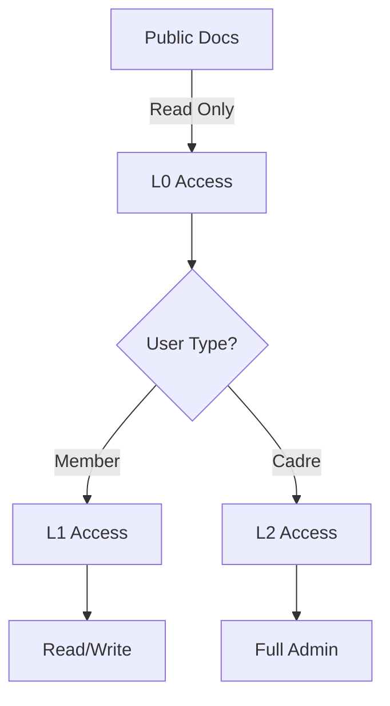

# Theme Test Page - All Elements

This page showcases all theme elements for visual testing during development.

## Typography Tests

### Heading Hierarchy

# Heading 1 - Main Title

## Heading 2 - Section Title

### Heading 3 - Subsection

#### Heading 4 - Sub-subsection

##### Heading 5 - Minor Heading

###### Heading 6 - Smallest Heading

### Body Text

This is a regular paragraph with **bold text**, _italic text_, and **_bold italic text_**. We also have `inline code` and ~~strikethrough text~~.

Here's a longer paragraph to test readability: Lorem ipsum dolor sit amet, consectetur adipiscing elit. Sed do eiusmod tempor incididunt ut labore et dolore magna aliqua. Ut enim ad minim veniam, quis nostrud exercitation ullamco laboris nisi ut aliquip ex ea commodo consequat.

## Lists

### Unordered List

- First item
- Second item
  - Nested item 1
  - Nested item 2
    - Deep nested item
- Third item

### Ordered List

1. First step
2. Second step
   1. Sub-step A
   2. Sub-step B
3. Third step

### Task List

- [x] Completed task
- [ ] Uncompleted task
- [x] Another completed task

## Code Blocks

### Python Code

```python
# Development server with hot reload
def serve():
    """Start the development server."""
    cd repos/druids-wiki
    mkdocs build
    mkdocs serve --dev-addr 127.0.0.1:8001
```

### Bash Script

```bash
#!/bin/bash
# Check for issues
mkdocs build 2>&1 | grep -E "(WARNING|ERROR)"
```

### JavaScript

```javascript
// Initialize Mermaid for diagram rendering
document.addEventListener('DOMContentLoaded', function() {
    if (typeof mermaid !== 'undefined') {
        mermaid.initialize({
            startOnLoad: true,
            theme: 'dark'
        });
    }
});
```

### YAML Configuration

```yaml
theme:
  name: material
  palette:
    scheme: slate
    primary: custom
    accent: custom
```

## Tables

### Simple Table

| Feature      | L0 Public | L1 Member | L2 Cadre |
| ------------ | --------- | --------- | -------- |
| Read Access  | ✓         | ✓         | ✓        |
| Write Access | ✗         | ✓         | ✓        |
| Admin Access | ✗         | ✗         | ✓        |

### Complex Table with Alignment

| Command      | Description    |        Example         | Security Level |
| :----------- | :------------- | :--------------------: | -------------: |
| `git status` | Check status   |    `git status -s`     |             L0 |
| `git commit` | Commit changes | `git commit -m "msg"`  |             L1 |
| `git push`   | Push to remote | `git push origin main` |             L2 |

## Admonitions

!!! note "Note Admonition"
This is a note with important information.

!!! warning "Warning Admonition"
This is a warning about security considerations.

!!! tip "Tip Admonition"
This is a helpful tip for users.

!!! danger "Danger Admonition"
This indicates dangerous operations.

!!! info "Information"
Additional information for context.

!!! success "Success"
Operation completed successfully!

!!! question "Question"
Common questions and answers.

!!! quote "Quote" > "The revolution is not an apple that falls when it is ripe. You have to make it fall." > > — Che Guevara

## Links and Buttons

- [Internal Link to Home](index.md)
- [External Link to GitHub](https://github.com)
- [Link with Title](https://example.com 'Example Website')

## Blockquotes

> This is a simple blockquote.

> This is a multi-line blockquote.
> It continues on the second line.
>
> And has multiple paragraphs.

## Horizontal Rules

---

## Images (Placeholder)


## Mermaid Diagrams



## Security Badges

<span class="security-badge l0">L0 Public</span>
<span class="security-badge l1">L1 Member</span>
<span class="security-badge l2">L2 Cadre</span>

## Search Box Example

<div class="md-search" data-md-component="search">
  <label class="md-search__overlay" for="__search"></label>
  <div class="md-search__inner">
    <form class="md-search__form">
      <input type="text" class="md-search__input" placeholder="Search documentation..." />
    </form>
  </div>
</div>

## Navigation Example

<nav class="md-nav">
  <ul class="md-nav__list">
    <li class="md-nav__item">
      <a href="#" class="md-nav__link">Getting Started</a>
    </li>
    <li class="md-nav__item md-nav__item--active">
      <a href="#" class="md-nav__link md-nav__link--active">Core Concepts</a>
    </li>
    <li class="md-nav__item">
      <a href="#" class="md-nav__link">Implementation</a>
    </li>
  </ul>
</nav>

## Footer

---

_This page is used for theme development and testing purposes._
